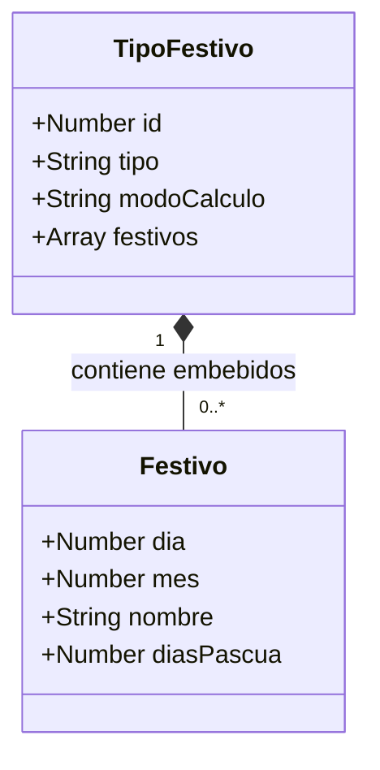
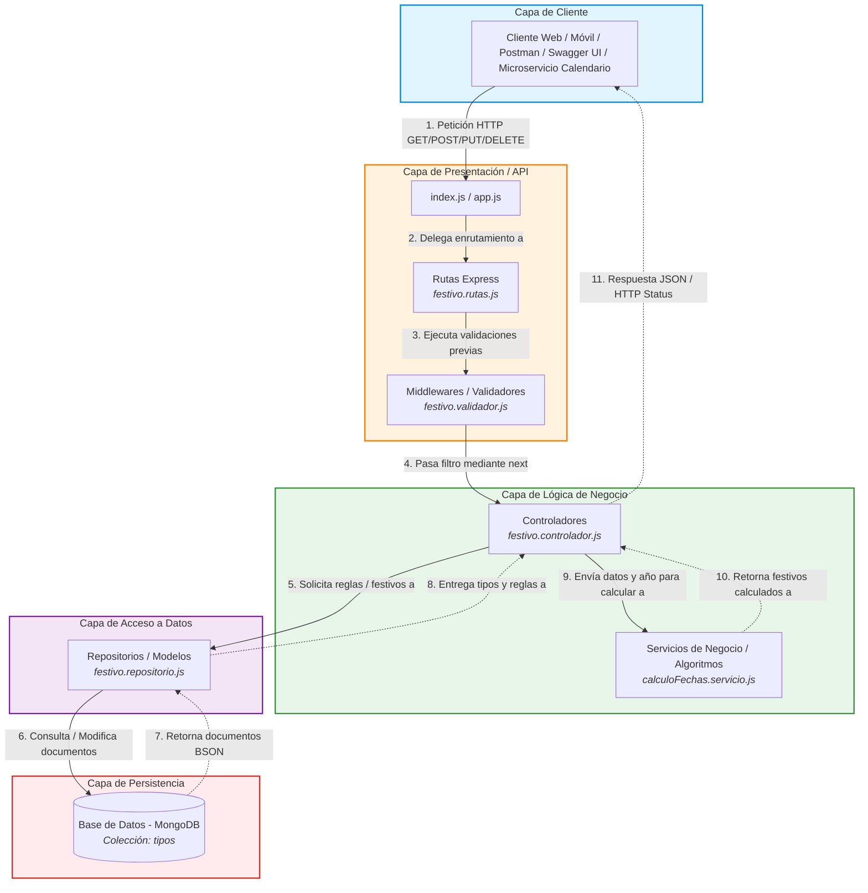

# Arquitectura de Software II - Evaluación 1 (Seguimiento 20%)
## Modelado Arquitectónico: Microservicio de Festivos (Express.js + MongoDB)

> **Institución:** Instituto Tecnológico Metropolitano (ITM)  
> **Docente:** Fray León Osorio Rivera (`frayosorio@gmail.com`)  
> **Asignatura:** Arquitectura de Software II  
> **Fecha de Entrega:** Septiembre 24, 2026  
> **Repositorio Oficial:** [https://github.com/Camilo015H/arquitectura-api-festivos](https://github.com/Camilo015H/arquitectura-api-festivos)

---

## 👥 Integrantes del Equipo

| # | Nombre Completo | Usuario GitHub |
| :-: | :--- | :--- |
| 1 | **Camilo Ospina Hernández** | [@Camilo015H](https://github.com/Camilo015H) |
| 2 | **Luis David Orozco Moreno** | Integrante |

---

## 📌 Resumen de la Solución

El presente repositorio contiene la entrega oficial de la **fase de modelado arquitectónico** para la **API RESTful de Festivos de Colombia**, construida sobre el stack **Node.js + Express.js** y persistida en **MongoDB**.

Cumpliendo rigurosamente con los lineamientos técnicos y pedagógicos del docente Fray León Osorio Rivera:
1. **Modelado en Código Editable (*Diagrams as Code*):** Se utiliza exclusivamente la sintaxis estándar de **Mermaid.js**, permitiendo renderizado nativo en GitHub, control de versiones sin imágenes estáticas y portabilidad completa.
2. **Correspondencia Fiel con la Implementación:** Los diagramas reflejan directamente la estructura de archivos, módulos y capas que se codificarán en la etapa posterior de implementación.
3. **Aislamiento de Lógica Algorítmica:** La base de datos almacena las reglas y directrices de cálculo (no fechas estáticas). La arquitectura incorpora formalmente un servicio especializado para el cálculo de la Pascua y los traslados al lunes ordenados por la Ley Emiliani (Ley 51 de 1983).

---

## 📊 Diagrama 1: Modelo Objetual de Base de Datos NoSQL (MongoDB)

*Archivo fuente individual:* [`diagrama-objetual-festivos.md`](./diagrama-objetual-festivos.md)

### Justificación
Para bases de datos de documentos como MongoDB, el estándar de modelado no es el modelo relacional tradicional, sino el **Diagrama de Clases** representando **Colecciones y Subdocumentos Embebidos**. 
La colección raíz `TipoFestivo` (`tipos`) agrupa mediante agregación/composición (`*--`) un conjunto de festivos (`0..*`), eliminando la necesidad de llaves foráneas (`FK`) o uniones (`JOIN`) costosas.

---

## 🏛️ Diagrama 2: Arquitectura por Capas del Microservicio

*Archivo fuente individual:* [`diagrama-arquitectura-festivos.md`](./diagrama-arquitectura-festivos.md)

### Justificación
Sigue un patrón horizontal por capas estricto (*Separation of Concerns*):
* **Entrada y Validación:** El middleware `festivo.validador.js` actúa como *Chain of Responsibility* (`next()`) antes del controlador, garantizando el rechazo temprano de fechas erróneas (ej. 35 de febrero).
* **Lógica de Negocio Desacoplada:** `calculoFechas.servicio.js` aísla las fórmulas astronómicas de la Pascua y los traslados al lunes de la Ley Emiliani.
* **Acceso a Datos:** `festivo.repositorio.js` gestiona directamente las colecciones en MongoDB sin sobrecarga innecesaria de frameworks.

---

## 🔌 Especificación de Operaciones y Endpoints

| Método | Endpoint | Descripción de Negocio | Respuesta Esperada |
| :--- | :--- | :--- | :--- |
| `GET` | `/api/festivos/verificar/:anio/:mes/:dia` | Verifica si una fecha puntual es festiva en Colombia. | `"Es Festivo"` / `"No es festivo"` / `"Fecha No valida"` |
| `GET` | `/api/festivos/obtener/:anio` | Devuelve el listado completo de festivos del año (consumido por Spring Boot). | Array JSON de festivos con fechas `AAAA-MM-DD`. |
| `POST`| `/api/festivos/agregar` | Registra una nueva regla de festivo dentro de un tipo existente (ej. Virgen de Chiquinquirá). | Objeto festivo registrado con `201 Created`. |
| `PUT` | `/api/festivos/modificar` | Actualiza la información o regla de un festivo embebido. | Objeto modificado con `200 OK`. |
| `DELETE`| `/api/festivos/eliminar/:id` | Elimina la configuración de un festivo. | Mensaje de confirmación con `200 OK`. |
