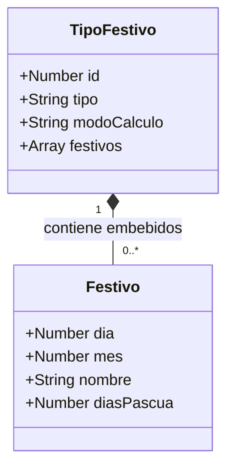
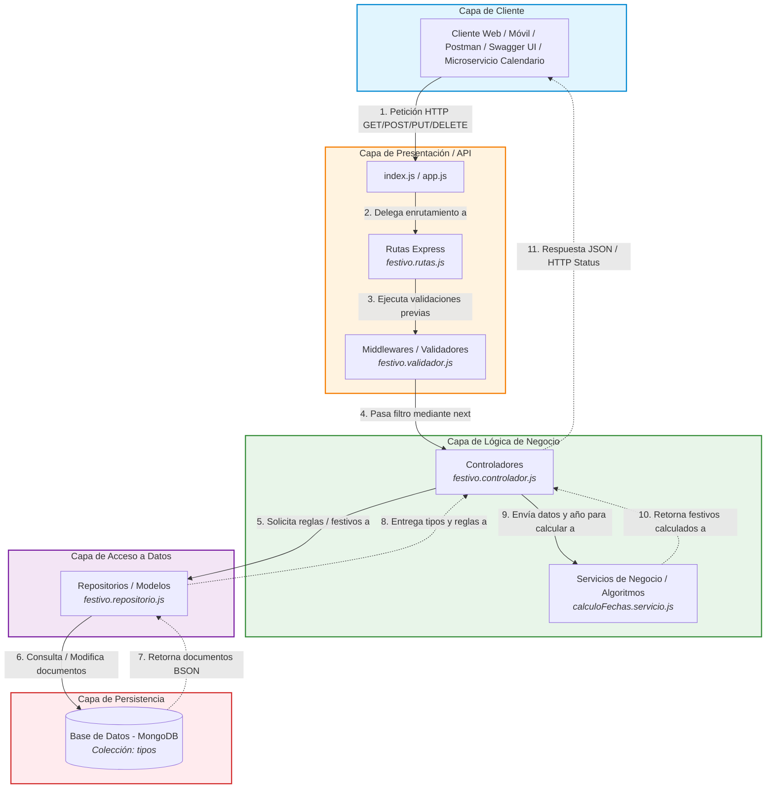
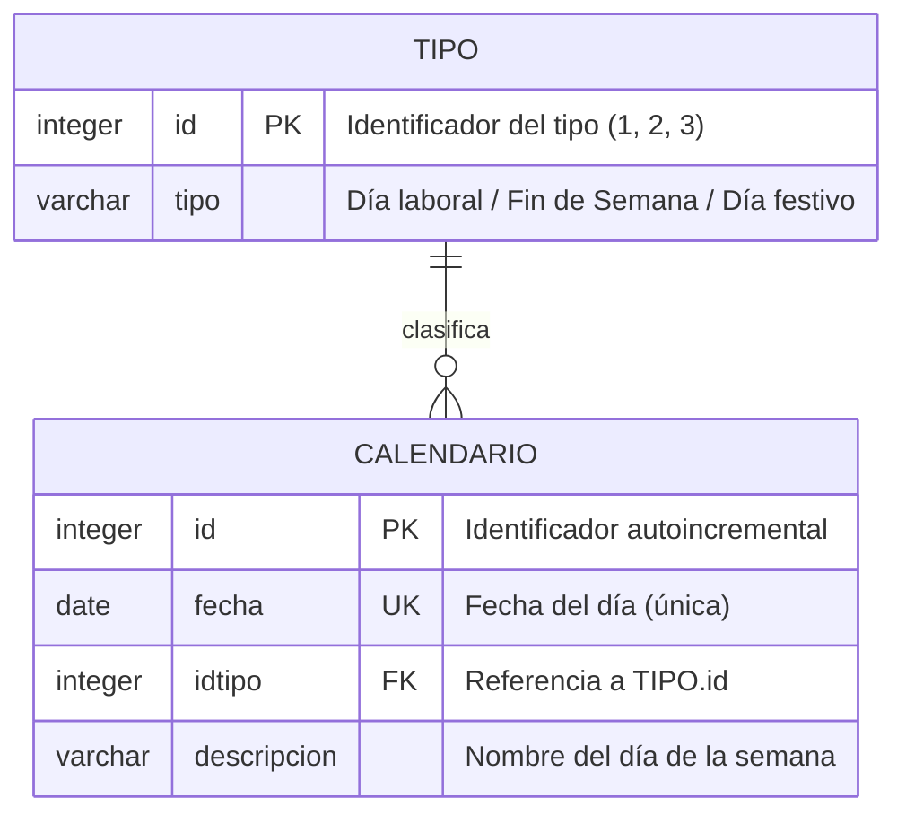

# Arquitectura de Software II - Taller 1 (Seguimientos 1 y 2 - 40%)
## Modelado Arquitectónico: Microservicios de Festivos (Express.js + MongoDB) y Calendario (Spring Boot + PostgreSQL)

> **Institución:** Instituto Tecnológico Metropolitano (ITM)  
> **Docente:** Fray León Osorio Rivera (`frayosorio@gmail.com`)  
> **Asignatura:** Arquitectura de Software II  
> **Entrega Seguimiento 1 (API Festivos):** Septiembre 24, 2026  
> **Entrega Seguimiento 2 (API Calendario):** Octubre 8, 2026  
> **Repositorio Oficial:** [https://github.com/CamiloO15H/arquitectura-api-festivos](https://github.com/CamiloO15H/arquitectura-api-festivos)

---

## 👥 Integrantes del Equipo

| # | Nombre Completo | Usuario GitHub |
| :-: | :--- | :--- |
| 1 | **Camilo Ospina Hernández** | [@CamiloO15H](https://github.com/CamiloO15H) |
| 2 | **Luis David Orozco Moreno** | Integrante |

---

## 📌 Resumen de la Solución

El presente repositorio contiene la entrega oficial de la **fase de modelado arquitectónico** para la **API RESTful de Festivos de Colombia**, construida sobre el stack **Node.js + Express.js** y persistida en **MongoDB**.

Cumpliendo rigurosamente con los lineamientos técnicos y pedagógicos del docente Fray León Osorio Rivera:
1. **Modelado en Código Editable (*Diagrams as Code*):** Se utiliza exclusivamente la sintaxis estándar de **Mermaid.js**, permitiendo renderizado nativo en GitHub, control de versiones sin imágenes estáticas y portabilidad completa.
2. **Correspondencia Fiel con la Implementación:** Los diagramas reflejan directamente la estructura de archivos, módulos y capas que se codificarán en la etapa posterior de implementación.
3. **Aislamiento de Lógica Algorítmica:** La base de datos almacena las reglas y directrices de cálculo (no fechas estáticas). La arquitectura incorpora formalmente un servicio especializado para el cálculo de la Pascua y los traslados al lunes ordenados por la Ley Emiliani (Ley 51 de 1983).

---

## 📊 Diagrama 1: Modelo Objetual de Base de Datos NoSQL (MongoDB)

*Archivo fuente individual:* [`diagrama-objetual-festivos.md`](./diagrama-objetual-festivos.md)

### Justificación
Para bases de datos de documentos como MongoDB, el estándar de modelado no es el modelo relacional tradicional, sino el **Diagrama de Clases** representando **Colecciones y Subdocumentos Embebidos**. 
La colección raíz `TipoFestivo` (`tipos`) agrupa mediante agregación/composición (`*--`) un conjunto de festivos (`0..*`), eliminando la necesidad de llaves foráneas (`FK`) o uniones (`JOIN`) costosas.

```mermaid
classDiagram
    class TipoFestivo {
        +Number id
        +String tipo
        +String modoCalculo
        +Array festivos
    }

    class Festivo {
        +Number dia
        +Number mes
        +String nombre
        +Number diasPascua
    }

    TipoFestivo "1" *-- "0..*" Festivo : contiene embebidos
```

---

## 🏛️ Diagrama 2: Arquitectura por Capas del Microservicio

*Archivo fuente individual:* [`diagrama-arquitectura-festivos.md`](./diagrama-arquitectura-festivos.md)

### Justificación
Sigue un patrón horizontal por capas estricto (*Separation of Concerns*):
* **Entrada y Validación:** El middleware `festivo.validador.js` actúa como *Chain of Responsibility* (`next()`) antes del controlador, garantizando el rechazo temprano de fechas erróneas (ej. 35 de febrero).
* **Lógica de Negocio Desacoplada:** `calculoFechas.servicio.js` aísla las fórmulas astronómicas de la Pascua y los traslados al lunes de la Ley Emiliani.
* **Acceso a Datos:** `festivo.repositorio.js` gestiona directamente las colecciones en MongoDB sin sobrecarga innecesaria de frameworks.

```mermaid
graph TD
    %% Capa de Cliente / Presentación Externa
    subgraph ClientLayer [Capa de Cliente]
        Client[Cliente Web / Móvil / Postman / Swagger UI / Microservicio Calendario]
    end

    %% Capa de Presentación / API Gateway Local
    subgraph PresentationLayer [Capa de Presentación / API]
        Index[index.js / app.js]
        Routes[Rutas Express<br/><i>festivo.rutas.js</i>]
        Validators[Middlewares / Validadores<br/><i>festivo.validador.js</i>]
    end

    %% Capa de Lógica de Negocio
    subgraph BusinessLayer [Capa de Lógica de Negocio]
        Controllers[Controladores<br/><i>festivo.controlador.js</i>]
        Services[Servicios de Negocio / Algoritmos<br/><i>calculoFechas.servicio.js</i>]
    end

    %% Capa de Acceso a Datos
    subgraph DataAccessLayer [Capa de Acceso a Datos]
        Repositories[Repositorios / Modelos<br/><i>festivo.repositorio.js</i>]
    end

    %% Capa de Persistencia
    subgraph PersistenceLayer [Capa de Persistencia]
        DB[(Base de Datos - MongoDB<br/><i>Colección: tipos</i>)]
    end

    %% Flujo de la Petición (Request)
    Client -->|1. Petición HTTP GET/POST/PUT/DELETE| Index
    Index -->|2. Delega enrutamiento a| Routes
    Routes -->|3. Ejecuta validaciones previas| Validators
    Validators -->|4. Pasa filtro mediante next| Controllers
    Controllers -->|5. Solicita reglas / festivos a| Repositories
    Repositories -->|6. Consulta / Modifica documentos| DB

    %% Flujo de la Respuesta (Response) y Cálculo de Negocio
    DB -.->|7. Retorna documentos BSON| Repositories
    Repositories -.->|8. Entrega tipos y reglas a| Controllers
    Controllers -->|9. Envía datos y año para calcular a| Services
    Services -.->|10. Retorna festivos calculados a| Controllers
    Controllers -.->|11. Respuesta JSON / HTTP Status| Client

    %% Estilos de Nodos (Paleta de Colores Institucional)
    style ClientLayer fill:#e1f5fe,stroke:#0288d1,stroke-width:2px
    style PresentationLayer fill:#fff3e0,stroke:#f57c00,stroke-width:2px
    style BusinessLayer fill:#e8f5e9,stroke:#388e3c,stroke-width:2px
    style DataAccessLayer fill:#f3e5f5,stroke:#7b1fa2,stroke-width:2px
    style PersistenceLayer fill:#ffebee,stroke:#d32f2f,stroke-width:2px
```

---

## 🔌 Especificación de Operaciones y Endpoints

| Método | Endpoint | Descripción de Negocio | Respuesta Esperada |
| :--- | :--- | :--- | :--- |
| `GET` | `/api/festivos/verificar/:anio/:mes/:dia` | Verifica si una fecha puntual es festiva en Colombia. | `"Es Festivo"` / `"No es festivo"` / `"Fecha No valida"` |
| `GET` | `/api/festivos/obtener/:anio` | Devuelve el listado completo de festivos del año (consumido por Spring Boot). | Array JSON de festivos con fechas `AAAA-MM-DD`. |
| `POST`| `/api/festivos/agregar` | Registra una nueva regla de festivo dentro de un tipo existente (ej. Virgen de Chiquinquirá). | Objeto festivo registrado con `201 Created`. |
| `PUT` | `/api/festivos/modificar` | Actualiza la información o regla de un festivo embebido. | Objeto modificado con `200 OK`. |
| `DELETE`| `/api/festivos/eliminar/:id` | Elimina la configuración de un festivo. | Mensaje de confirmación con `200 OK`. |

---

# Segundo Seguimiento (20%): Microservicio de Calendario (Spring Boot + PostgreSQL)

Este microservicio es **cliente** de la API de Festivos: consume `GET /api/festivos/obtener/{anio}` para obtener los festivos de un año, clasifica todos los días del año (laboral, fin de semana o festivo) y los almacena en PostgreSQL.

## 📊 Diagrama 3: Modelo Relacional de Base de Datos (PostgreSQL)

*Archivo fuente individual:* [`diagrama-relacional-calendario.md`](./diagrama-relacional-calendario.md)

### Justificación
Los datos del calendario tienen un esquema fijo y una relación directa entre entidades, por lo que se modelan con un **Diagrama Entidad-Relación**. Un `TIPO` clasifica cero o muchos días del `CALENDARIO` mediante la llave foránea `idtipo`.

```mermaid
erDiagram
    TIPO ||--o{ CALENDARIO : "clasifica"

    TIPO {
        integer id PK "Identificador del tipo (1, 2, 3)"
        varchar tipo "Día laboral / Fin de Semana / Día festivo"
    }

    CALENDARIO {
        integer id PK "Identificador autoincremental"
        date fecha UK "Fecha del día (única)"
        integer idtipo FK "Referencia a TIPO.id"
        varchar descripcion "Nombre del día de la semana"
    }
```

---

## 🏛️ Diagrama 4: Arquitectura por Capas del Microservicio de Calendario

*Archivo fuente individual:* [`diagrama-arquitectura-calendario.md`](./diagrama-arquitectura-calendario.md)

### Justificación
* **Capas estrictas:** el controlador solo habla con el servicio (a través de su interfaz) y el servicio es el único que accede a los repositorios y al cliente HTTP.
* **Cliente HTTP como fuente de datos:** `FestivoCliente.java` (RestTemplate) encapsula la comunicación con la API de Festivos, de modo que el servicio la trata igual que a un repositorio.
* **Persistencia con Spring Data JPA:** repositorios `JpaRepository` sobre las entidades `Calendario` y `Tipo`.

```mermaid
graph TD
    subgraph ClientLayer [Capa de Cliente]
        Client[Cliente Web / Móvil / Postman / Swagger UI]
    end

    subgraph PresentationLayer [Capa de Presentación / API]
        App[CalendarioApplication.java<br/><i>@SpringBootApplication</i>]
        Controllers[Controladores REST<br/><i>CalendarioControlador.java</i>]
    end

    subgraph BusinessLayer [Capa de Lógica de Negocio]
        IServices[Interfaces de Servicio<br/><i>ICalendarioServicio.java</i>]
        Services[Servicios<br/><i>CalendarioServicio.java</i>]
    end

    subgraph DataAccessLayer [Capa de Acceso a Datos]
        Repositories[Repositorios JPA<br/><i>ICalendarioRepositorio.java, ITipoRepositorio.java</i>]
        Entities[Entidades JPA<br/><i>Calendario.java, Tipo.java</i>]
        HttpClient[Cliente HTTP<br/><i>FestivoCliente.java - RestTemplate</i>]
    end

    subgraph PersistenceLayer [Capa de Persistencia]
        DB[(Base de Datos - PostgreSQL<br/><i>Tablas: tipo, calendario</i>)]
    end

    subgraph ExternalLayer [Microservicio Externo]
        FestivosAPI[API Festivos<br/><i>Express.js + MongoDB</i><br/>GET /api/festivos/obtener/:anio]
    end

    Client -->|1. Petición HTTP GET generar / listar| App
    App -->|2. DispatcherServlet enruta a| Controllers
    Controllers -->|3. Invoca operación de| IServices
    IServices -->|4. Implementada por| Services
    Services -->|5. Solicita festivos del año a| HttpClient
    HttpClient -->|6. Petición HTTP GET| FestivosAPI
    FestivosAPI -.->|7. Lista JSON de festivos| HttpClient
    HttpClient -.->|8. Lista de FestivoDto| Services
    Services -->|9. Clasifica cada día y guarda mediante| Repositories
    Repositories -->|10. Mapea| Entities
    Repositories -->|11. INSERT / SELECT| DB

    DB -.->|12. Retorna registros| Repositories
    Repositories -.->|13. Entidades Calendario / Tipo| Services
    Services -.->|14. Resultado true o lista de días| Controllers
    Controllers -.->|15. Respuesta JSON / HTTP Status| Client

    style ClientLayer fill:#e1f5fe,stroke:#0288d1,stroke-width:2px
    style PresentationLayer fill:#fff3e0,stroke:#f57c00,stroke-width:2px
    style BusinessLayer fill:#e8f5e9,stroke:#388e3c,stroke-width:2px
    style DataAccessLayer fill:#f3e5f5,stroke:#7b1fa2,stroke-width:2px
    style PersistenceLayer fill:#ffebee,stroke:#d32f2f,stroke-width:2px
    style ExternalLayer fill:#eceff1,stroke:#455a64,stroke-width:2px,stroke-dasharray: 5 5
```

---

## 🔌 Endpoints del Microservicio de Calendario

| Método | Endpoint | Descripción de Negocio | Respuesta Esperada |
| :--- | :--- | :--- | :--- |
| `GET` | `/api/calendario/generar/{anio}` | Consume la API de Festivos, clasifica todos los días del año y los almacena en PostgreSQL. | `true` si el proceso fue exitoso, `false` en caso contrario. |
| `GET` | `/api/calendario/listar/{anio}` | Devuelve el calendario completo del año con cada día clasificado. | Array JSON de días con `id`, `fecha`, `tipo` y `descripcion`. |
