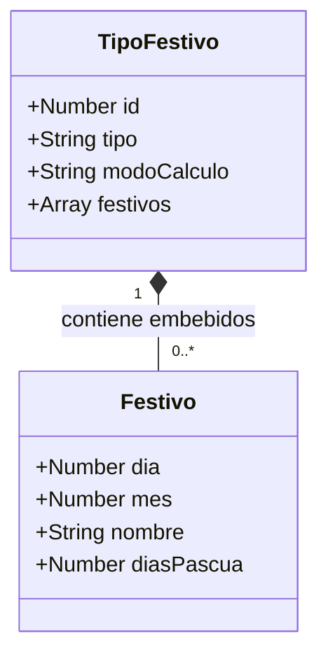
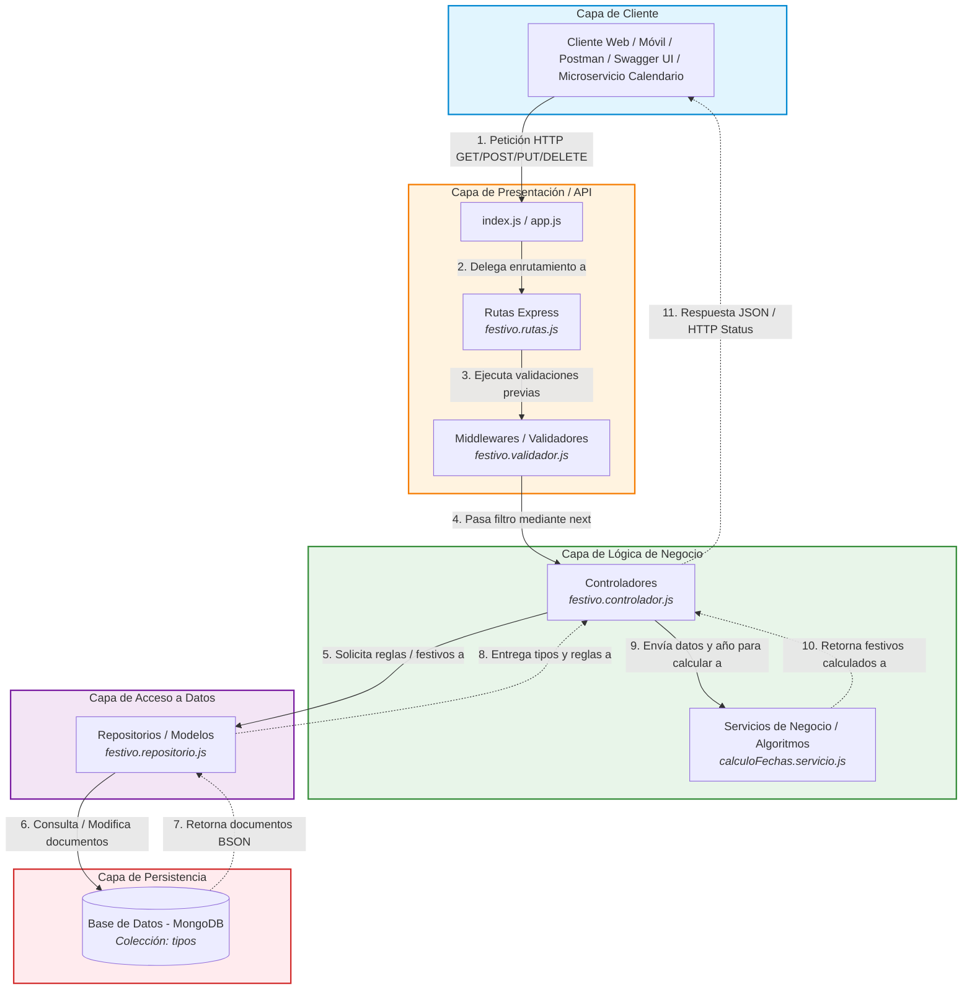
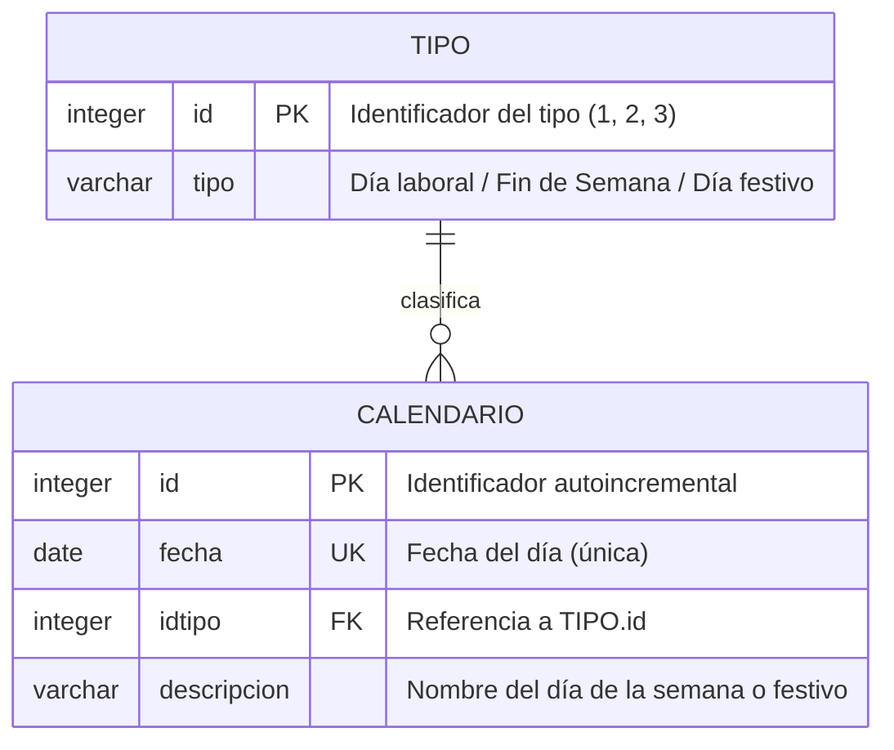

# Arquitectura de Software II - Taller 1 (Seguimientos 1 y 2 - 40%)
## Modelado Arquitectónico: Microservicios de Festivos (Express.js + MongoDB) y Calendario (Spring Boot + PostgreSQL)

> **Institución:** Instituto Tecnológico Metropolitano (ITM)  
> **Docente:** Fray León Osorio Rivera (`frayosorio@gmail.com`)  
> **Asignatura:** Arquitectura de Software II  
> **Entrega Seguimiento 1 (API Festivos - 20%):** Septiembre 24, 2026  
> **Entrega Seguimiento 2 (API Calendario - 20%):** Octubre 8, 2026  
> **Repositorio Oficial:** [https://github.com/CamiloO15H/arquitectura-api-festivos](https://github.com/CamiloO15H/arquitectura-api-festivos)

---

## 👥 Integrantes del Equipo

| # | Nombre Completo | Usuario GitHub |
| :-: | :--- | :--- |
| 1 | **Camilo Ospina Hernández** | [@CamiloO15H](https://github.com/CamiloO15H) |
| 2 | **Luis David Orozco Moreno** | Integrante |

---

## 📌 Resumen de la Solución

El presente repositorio contiene la entrega oficial de la **fase de modelado arquitectónico** para dos microservicios interconectados:
1. **API Festivos de Colombia (Seguimiento 1 - 20%):** Desarrollada sobre el stack **Node.js + Express.js** y persistida en **MongoDB**. Calcula festivos fijos, Ley Emiliani (traslados a lunes) y Pascua católica.
2. **API Calendario (Seguimiento 2 - 20%):** Desarrollada en **Java + Spring Boot + Spring Data JPA** y persistida en **PostgreSQL**, implementada bajo el patrón de **Arquitectura Cebolla (*Onion Architecture*)**. Consume la API de Festivos para clasificar y persistir todos los días del año.

Cumpliendo rigurosamente con los lineamientos técnicos y pedagógicos del docente Fray León Osorio Rivera:
* **Modelado en Código Editable (*Diagrams as Code*):** Sintaxis estándar de **Mermaid.js**, renderizable nativamente en GitHub.
* **Correspondencia Fiel con la Implementación:** Los diagramas reflejan directamente las clases, módulos e interfaces del código fuente.
* **Aislamiento de Lógica Algorítmica:** La base de datos almacena directrices de cálculo y tipos, mientras la lógica reside desacoplada en los servicios.

---

# 🚀 Primer Seguimiento (20%): API Festivos (Express.js + MongoDB)

## 📊 Diagrama 1: Modelo Objetual de Base de Datos NoSQL (MongoDB)

*Archivo fuente individual:* [`diagrama-objetual-festivos.md`](./diagrama-objetual-festivos.md)

### Justificación
Para bases de datos de documentos como MongoDB, el estándar de modelado es el **Diagrama de Clases** representando **Colecciones y Subdocumentos Embebidos**. La colección raíz `TipoFestivo` (`tipos`) agrupa mediante composición (`*--`) un conjunto de festivos (`0..*`), eliminando llaves foráneas y uniones costosas.

```mermaid
classDiagram
    class TipoFestivo {
        +Number id
        +String tipo
        +String modoCalculo
        +Array festivos
    }

    class Festivo {
        +Number dia
        +Number mes
        +String nombre
        +Number diasPascua
    }

    TipoFestivo "1" *-- "0..*" Festivo : contiene embebidos
```

---

## 🏛️ Diagrama 2: Arquitectura por Capas del Microservicio de Festivos

*Archivo fuente individual:* [`diagrama-arquitectura-festivos.md`](./diagrama-arquitectura-festivos.md)

### Justificación
Sigue un patrón horizontal por capas estricto (*Separation of Concerns*):
* **Entrada y Validación:** El middleware `festivo.validador.js` actúa como *Chain of Responsibility* (`next()`) antes del controlador.
* **Lógica de Negocio Desacoplada:** `calculoFechas.servicio.js` aísla el cálculo de la Pascua y los traslados al lunes de la Ley Emiliani (Ley 51 de 1983).
* **Acceso a Datos:** `festivo.repositorio.js` gestiona directamente las colecciones en MongoDB.

```mermaid
graph TD
    %% Capa de Cliente / Presentación Externa
    subgraph ClientLayer [Capa de Cliente]
        Client[Cliente Web / Móvil / Postman / Swagger UI / Microservicio Calendario]
    end

    %% Capa de Presentación / API Gateway Local
    subgraph PresentationLayer [Capa de Presentación / API]
        Index[index.js / app.js]
        Routes[Rutas Express<br/><i>festivo.rutas.js</i>]
        Validators[Middlewares / Validadores<br/><i>festivo.validador.js</i>]
    end

    %% Capa de Lógica de Negocio
    subgraph BusinessLayer [Capa de Lógica de Negocio]
        Controllers[Controladores<br/><i>festivo.controlador.js</i>]
        Services[Servicios de Negocio / Algoritmos<br/><i>calculoFechas.servicio.js</i>]
    end

    %% Capa de Acceso a Datos
    subgraph DataAccessLayer [Capa de Acceso a Datos]
        Repositories[Repositorios / Modelos<br/><i>festivo.repositorio.js</i>]
    end

    %% Capa de Persistencia
    subgraph PersistenceLayer [Capa de Persistencia]
        DB[(Base de Datos - MongoDB<br/><i>Colección: tipos</i>)]
    end

    %% Flujo de la Petición (Request)
    Client -->|1. Petición HTTP GET/POST/PUT/DELETE| Index
    Index -->|2. Delega enrutamiento a| Routes
    Routes -->|3. Ejecuta validaciones previas| Validators
    Validators -->|4. Pasa filtro mediante next| Controllers
    Controllers -->|5. Solicita reglas / festivos a| Repositories
    Repositories -->|6. Consulta / Modifica documentos| DB

    %% Flujo de la Respuesta (Response) y Cálculo de Negocio
    DB -.->|7. Retorna documentos BSON| Repositories
    Repositories -.->|8. Entrega tipos y reglas a| Controllers
    Controllers -->|9. Envía datos y año para calcular a| Services
    Services -.->|10. Retorna festivos calculados a| Controllers
    Controllers -.->|11. Respuesta JSON / HTTP Status| Client

    %% Estilos de Nodos
    style ClientLayer fill:#e1f5fe,stroke:#0288d1,stroke-width:2px
    style PresentationLayer fill:#fff3e0,stroke:#f57c00,stroke-width:2px
    style BusinessLayer fill:#e8f5e9,stroke:#388e3c,stroke-width:2px
    style DataAccessLayer fill:#f3e5f5,stroke:#7b1fa2,stroke-width:2px
    style PersistenceLayer fill:#ffebee,stroke:#d32f2f,stroke-width:2px
```

---

# 📅 Segundo Seguimiento (20%): API Calendario (Spring Boot + PostgreSQL)

*Fecha Límite:* **8 de Octubre de 2026**

Este microservicio cumple el doble rol de **servidor** (expone generación y listado del calendario) y **cliente** de la API de Festivos (`GET /api/festivos/obtener/{anio}` mediante `RestTemplate`), clasificando y persistiendo los 365/366 días de un año en PostgreSQL.

---

## 📊 Diagrama 3: Modelo Relacional de Base de Datos (PostgreSQL)

*Archivo fuente individual:* [`diagrama-relacional-calendario.md`](./diagrama-relacional-calendario.md)

### Justificación
Los datos del calendario poseen esquema tabular fijo y relaciones referenciales directas, modeladas mediante un **Diagrama Entidad-Relación (ER)**. La tabla `TIPO` clasifica días del `CALENDARIO` mediante la clave foránea `idtipo → tipo.id`.

```mermaid
erDiagram
    TIPO ||--o{ CALENDARIO : "clasifica"

    TIPO {
        integer id PK "Identificador del tipo (1, 2, 3)"
        varchar tipo "Día laboral / Fin de Semana / Día festivo"
    }

    CALENDARIO {
        integer id PK "Identificador autoincremental"
        date fecha UK "Fecha del día (única)"
        integer idtipo FK "Referencia a TIPO.id"
        varchar descripcion "Nombre del día de la semana o festivo"
    }
```

---

## 🏛️ Diagrama 4: Arquitectura Cebolla (Onion Architecture) - Spring Boot

*Archivo fuente individual:* [`diagrama-arquitectura-calendario.md`](./diagrama-arquitectura-calendario.md)

### Justificación
Implementa el patrón **Arquitectura Cebolla (*Onion Architecture*)** abordado en la sesión del 1 de octubre de 2026:
* **Módulo Dominio:** Entidades POJO puras de negocio (`Calendario`, `Tipo`, `Usuario`) y DTOs independientes.
* **Módulo Core:** Contratos de servicio (`ICalendarioServicio`), persistencia (`ICalendarioRepositorio`) e integración externa (`IFestivoServicioExterno`).
* **Módulo Aplicación:** Lógica orquestadora en `CalendarioServicio` y seguridad de la aplicación.
* **Módulo Infraestructura:** Implementaciones con `Spring Data JPA`, entidades ORM `@Entity`, mapeadores (`CalendarioMapeador`) y cliente HTTP `FestivoServicioExterno` con `HttpServicio` (`RestTemplate`).
* **Módulo Presentación:** Controladores REST (`CalendarioControlador`), Swagger y manejo de excepciones.

```mermaid
graph TD
%% Módulo Dominio
    subgraph Dominio [Módulo: dominio]
        Entidades[Calendario / Tipo / Usuario]
        DTOs[FestivoDto / CalendarioDto / UsuarioLoginDto]
    end

%% Módulo Core
    subgraph Core [Módulo: core]
        InterfacesServicio[ICalendarioServicio / ITipoServicio / IUsuarioServicio]
        InterfacesRepo[ICalendarioRepositorio / ITipoRepositorio<br/>IUsuarioRepositorio]
        InterfacesIntegracion[IFestivoServicioExterno]
    end

%% Módulo Aplicación
    subgraph Aplicacion [Módulo: aplicacion]
        ServiciosApp[CalendarioServicio / TipoServicio / UsuarioServicio]
        SeguridadApp[FiltroSeguridad / SeguridadServicio / UsuarioDetalleServicio / UsuarioDetalles]
    end

%% Módulo Infraestructura
    subgraph Infraestructura [Módulo: infraestructura]
        RepositoriosImpl[CalendarioRepositorio / TipoRepositorio<br/>UsuarioRepositorio]
        RepositoriosJPA[ICalendarioRepositorioJpa / ITipoRepositorioJpa<br/>IUsuarioRepositorioJpa]
        EntidadesJPA[CalendarioEntidad / TipoEntidad<br/>UsuarioEntidad]
        Mapeadores[CalendarioMapeador / TipoMapeador<br/>UsuarioMapeador]
        IntegracionExt[FestivoServicioExterno / HttpServicio]
        DB[(Base de Datos: PostgreSQL)]
        APIExterna[API Externa Festivos<br/>Express.js + MongoDB]
    end

%% Módulo Presentación
    subgraph Presentacion [Módulo: presentacion]
        ApiApp[CalendarioApplication @SpringBootApplication]
        Controladores[CalendarioControlador / TipoControlador / UsuarioControlador]
        Configuracion[ConfiguracionSeguridad / SwaggerConfig]
        Handlers[ExcepcionesGlobalesHandler]
        DtosPresentacion[ErrorRespuesta]
    end

%% Relaciones Aplicación -> Core / Dominio
    ServiciosApp -.->|Implementa| InterfacesServicio
    ServiciosApp -->|Inyecta| InterfacesRepo
    ServiciosApp -->|Inyecta| InterfacesIntegracion
    ServiciosApp -->|Maneja| Entidades
    SeguridadApp -->|Inyecta| InterfacesRepo

%% Relaciones Infraestructura -> Core / Dominio
    RepositoriosImpl -.->|Implementa| InterfacesRepo
    RepositoriosImpl -->|Inyecta| RepositoriosJPA
    RepositoriosImpl -->|Usa| Mapeadores

    Mapeadores -->|Transforma| Entidades
    Mapeadores -->|Transforma| EntidadesJPA

    FestivoServicioExterno -.->|Implementa| InterfacesIntegracion
    FestivoServicioExterno -->|RestTemplate / GET| APIExterna

%% Relaciones JPA -> Base de Datos
    RepositoriosJPA -->|Spring Data JPA / SQL| DB
    EntidadesJPA -->|Mapeo ORM @Entity| DB

%% Relaciones Presentación -> Aplicación / Core / Dominio
    Controladores -->|Inyecta| InterfacesServicio
    Controladores -->|Usa| DTOs
    Controladores -->|Usa| Entidades
    Configuracion -->|Usa| SeguridadApp
```

---

## 🔌 Especificación de Endpoints (API Calendario)

| Método | Endpoint | Descripción de Negocio | Respuesta Esperada |
| :--- | :--- | :--- | :--- |
| `GET` | `/api/calendario/generar/{anio}` | Consume festivos de la API Express, clasifica los días del año y los persiste en PostgreSQL. | `true` / `false` |
| `GET` | `/api/calendario/listar/{anio}` | Retorna el listado completo de los días del año clasificados con su tipo. | Array JSON de días con tipo anidado |
