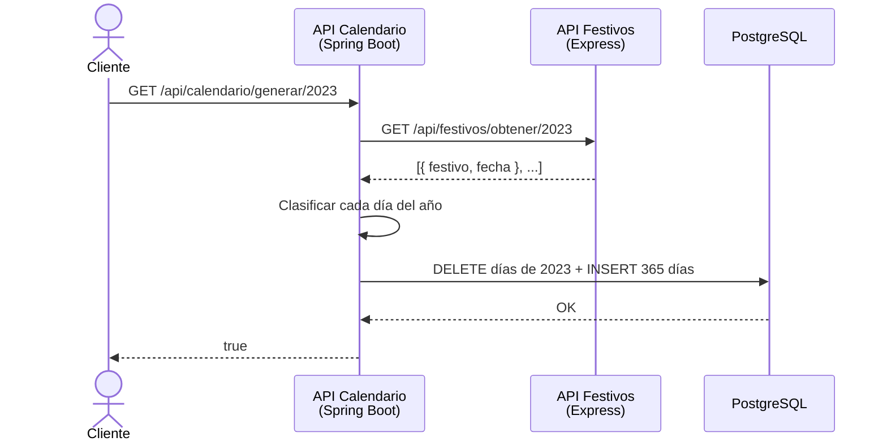

# Diagrama de Arquitectura por Capas - Microservicio API Calendario

> **Asignatura:** Arquitectura de Software II  
> **Docente:** Fray León Osorio Rivera  
> **Evaluación:** Segundo Seguimiento (20%) - Diagrama 2  
> **Stack Tecnológico:** Java + Spring Boot + Spring Data JPA + PostgreSQL  

---

## 1. Justificación Arquitectónica

El microservicio de Calendario cumple dos roles dentro de la solución:

- **Servidor:** expone los endpoints `generar` y `listar` del calendario.
- **Cliente:** consume el endpoint `GET /api/festivos/obtener/{anio}` del microservicio de Festivos (Express + MongoDB) para conocer los festivos del año.

Por eso, además de las capas tradicionales, la arquitectura incluye un **cliente HTTP** en la capa de acceso a datos. Desde el punto de vista del servicio de negocio, la API de Festivos es otra fuente de datos, igual que la base de datos: el servicio no sabe si los datos vienen de PostgreSQL o de una llamada HTTP.

1. **Separación de responsabilidades (*Separation of Concerns*):** cada capa solo llama a la inmediatamente inferior. El controlador nunca accede directamente al repositorio ni al cliente HTTP; todo pasa por el servicio.
2. **Inversión de dependencias:** el controlador depende de la interfaz `ICalendarioServicio`, no de su implementación. Spring inyecta la implementación (`@Autowired` / inyección por constructor).
3. **Lógica de negocio aislada en el servicio:** la clasificación de cada día (laboral, fin de semana o festivo) se hace en `CalendarioServicio`, recorriendo todos los días del año y cruzándolos con la lista de festivos recibida.
4. **Persistencia con Spring Data JPA:** los repositorios heredan de `JpaRepository`, lo que evita escribir SQL para las operaciones básicas.

---

## 2. Diagrama de Arquitectura por Capas en Mermaid

```mermaid
graph TD
    %% Capa de Cliente
    subgraph ClientLayer [Capa de Cliente]
        Client[Cliente Web / Móvil / Postman / Swagger UI]
    end

    %% Capa de Presentación
    subgraph PresentationLayer [Capa de Presentación / API]
        App[CalendarioApplication.java<br/><i>@SpringBootApplication</i>]
        Controllers[Controladores REST<br/><i>CalendarioControlador.java</i>]
    end

    %% Capa de Lógica de Negocio
    subgraph BusinessLayer [Capa de Lógica de Negocio]
        IServices[Interfaces de Servicio<br/><i>ICalendarioServicio.java</i>]
        Services[Servicios<br/><i>CalendarioServicio.java</i>]
    end

    %% Capa de Acceso a Datos
    subgraph DataAccessLayer [Capa de Acceso a Datos]
        Repositories[Repositorios JPA<br/><i>ICalendarioRepositorio.java, ITipoRepositorio.java</i>]
        Entities[Entidades JPA<br/><i>Calendario.java, Tipo.java</i>]
        HttpClient[Cliente HTTP<br/><i>FestivoCliente.java - RestTemplate</i>]
    end

    %% Capa de Persistencia
    subgraph PersistenceLayer [Capa de Persistencia]
        DB[(Base de Datos - PostgreSQL<br/><i>Tablas: tipo, calendario</i>)]
    end

    %% Microservicio externo
    subgraph ExternalLayer [Microservicio Externo]
        FestivosAPI[API Festivos<br/><i>Express.js + MongoDB</i><br/>GET /api/festivos/obtener/:anio]
    end

    %% Flujo de la Petición (Request)
    Client -->|1. Petición HTTP GET generar / listar| App
    App -->|2. DispatcherServlet enruta a| Controllers
    Controllers -->|3. Invoca operación de| IServices
    IServices -->|4. Implementada por| Services
    Services -->|5. Solicita festivos del año a| HttpClient
    HttpClient -->|6. Petición HTTP GET| FestivosAPI
    FestivosAPI -.->|7. Lista JSON de festivos| HttpClient
    HttpClient -.->|8. Lista de FestivoDto| Services
    Services -->|9. Clasifica cada día y guarda mediante| Repositories
    Repositories -->|10. Mapea| Entities
    Repositories -->|11. INSERT / SELECT| DB

    %% Flujo de la Respuesta (Response)
    DB -.->|12. Retorna registros| Repositories
    Repositories -.->|13. Entidades Calendario / Tipo| Services
    Services -.->|14. Resultado true o lista de días| Controllers
    Controllers -.->|15. Respuesta JSON / HTTP Status| Client

    %% Estilos
    style ClientLayer fill:#e1f5fe,stroke:#0288d1,stroke-width:2px
    style PresentationLayer fill:#fff3e0,stroke:#f57c00,stroke-width:2px
    style BusinessLayer fill:#e8f5e9,stroke:#388e3c,stroke-width:2px
    style DataAccessLayer fill:#f3e5f5,stroke:#7b1fa2,stroke-width:2px
    style PersistenceLayer fill:#ffebee,stroke:#d32f2f,stroke-width:2px
    style ExternalLayer fill:#eceff1,stroke:#455a64,stroke-width:2px,stroke-dasharray: 5 5
```

---

## 3. Matriz de Componentes y Responsabilidades

| Capa | Archivo / Componente | Responsabilidad Técnica |
| :--- | :--- | :--- |
| **Cliente** | Postman / Swagger UI | Genera peticiones HTTP y consume los endpoints del calendario en formato JSON. |
| **Presentación** | `CalendarioApplication.java` | Punto de entrada de Spring Boot. Arranca el servidor embebido (Tomcat) y el contenedor de inyección de dependencias. |
| **Presentación** | `CalendarioControlador.java` | `@RestController` con `@RequestMapping("/api/calendario")`. Recibe el año por `@PathVariable`, valida que sea un número válido y delega al servicio. |
| **Negocio** | `ICalendarioServicio.java` | Contrato del servicio: `boolean generar(int anio)` y `List<Calendario> listar(int anio)`. |
| **Negocio** | `CalendarioServicio.java` | `@Service`. Obtiene los festivos del año, recorre del 1 de enero al 31 de diciembre y clasifica cada día: festivo si está en la lista; si no, fin de semana (sábado o domingo) o laboral (lunes a viernes). Guarda todo en una sola transacción (`@Transactional`). |
| **Acceso a Datos** | `ICalendarioRepositorio.java` | `JpaRepository<Calendario, Integer>`. Guarda los días (`saveAll`), consulta por rango de fechas del año y elimina los días de un año. |
| **Acceso a Datos** | `ITipoRepositorio.java` | `JpaRepository<Tipo, Integer>`. Consulta el catálogo de tipos de día. |
| **Acceso a Datos** | `Calendario.java`, `Tipo.java` | Entidades `@Entity` mapeadas a las tablas `calendario` y `tipo`. `Calendario` tiene `@ManyToOne` hacia `Tipo`. |
| **Acceso a Datos** | `FestivoCliente.java` | `@Component` que usa `RestTemplate` para llamar a `GET /api/festivos/obtener/{anio}` y convertir la respuesta en `List<FestivoDto>`. La URL base se lee de `application.properties`. |
| **Persistencia** | PostgreSQL | Motor relacional donde residen las tablas `tipo` y `calendario`. |
| **Externo** | API Festivos (Express + MongoDB) | Microservicio del primer seguimiento. Calcula y devuelve los festivos de un año. |

---

## 4. Endpoints Expuestos por la Arquitectura

1. **Generar calendario de un año:**
   * **Ruta:** `GET /api/calendario/generar/{anio}`
   * **Ejemplo:** `/api/calendario/generar/2023` → Respuesta: `true`
   * **Proceso:** consume la API de Festivos, clasifica los 365 (o 366) días del año y los almacena en PostgreSQL. Si el año ya había sido generado, se eliminan sus registros antes de volver a insertarlos, para no duplicar fechas.
   * **Error:** si la API de Festivos no responde o falla el guardado, la transacción se revierte y se responde `false`.

2. **Listar calendario de un año:**
   * **Ruta:** `GET /api/calendario/listar/{anio}`
   * **Respuesta:** Array JSON con todos los días del año clasificados:

   ```json
   [
     { "id": 1, "fecha": "2023-01-01", "tipo": { "id": 3, "tipo": "Día festivo" }, "descripcion": "Domingo" },
     { "id": 2, "fecha": "2023-01-02", "tipo": { "id": 1, "tipo": "Día laboral" }, "descripcion": "Lunes" }
   ]
   ```

---

## 5. Integración entre Microservicios


