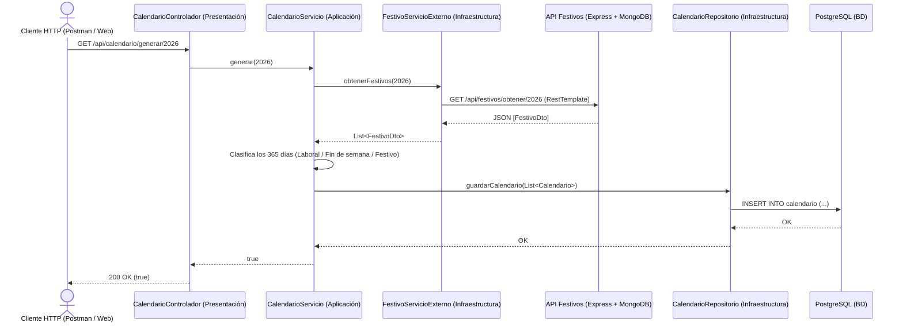

# Diagrama de Arquitectura Cebolla (Onion Architecture) - Microservicio API Calendario

> **Asignatura:** Arquitectura de Software II  
> **Docente:** Fray León Osorio Rivera (`frayosorio@gmail.com`)  
> **Evaluación:** Segundo Seguimiento (20%) - Diagrama de Aplicación  
> **Stack Tecnológico:** Java + Spring Boot + Spring Data JPA + PostgreSQL  
> **Fecha Límite:** 8 de Octubre de 2026  

---

## 1. Justificación Arquitectónica: Arquitectura Cebolla (Onion Architecture)

Para el desarrollo del microservicio de Calendario en **Spring Boot**, se adopta rigurosamente el patrón de **Arquitectura Cebolla (*Onion Architecture*)**, siguiendo la cátedra y directriz técnica impartida por el docente Fray León Osorio Rivera (sesión del 1 de octubre de 2026).

A diferencia de la arquitectura por capas tradicional (donde las capas superiores dependen en cascada de la base de datos), la Arquitectura Cebolla sitúa el **dominio y las reglas de negocio en el centro absoluto**, garantizando que el núcleo sea 100% independiente de frameworks, bases de datos y servicios externos:

1. **Independencia del Dominio (Módulo `dominio`):**  
   Contiene las entidades puras del negocio (`Calendario`, `Tipo`, `Usuario`) y los objetos de transferencia de datos (`FestivoDto`, `CalendarioDto`, `UsuarioLoginDto`). No contienen anotaciones de persistencia (`@Entity`) ni dependencias de Spring.
2. **Contratos y Casos de Uso en el Núcleo (Módulo `core`):**  
   Define los contratos mediante interfaces puras:
   * **`InterfacesServicio`:** `ICalendarioServicio`, `ITipoServicio`, `IUsuarioServicio`.
   * **`InterfacesRepo`:** `ICalendarioRepositorio`, `ITipoRepositorio`, `IUsuarioRepositorio`.
   * **`InterfacesIntegracion`:** `IFestivoServicioExterno` (contrato para consumir festivos sin atarse a HTTP o URLs).
3. **Orquestación de Negocio (Módulo `aplicacion`):**  
   Los servicios de aplicación (`CalendarioServicio`, etc.) implementan los contratos del Core e inyectan las interfaces de repositorios e integración. La lógica de clasificar días (laboral, fin de semana, festivo) reside aquí. El submódulo de seguridad (`FiltroSeguridad`, `SeguridadServicio`) protege los recursos.
4. **Desacoplamiento Tecnológico (Módulo `infraestructura`):**  
   Aquí residen los detalles técnicos y adaptadores:
   * **`RepositoriosImpl`:** Implementan las interfaces del Core conectando con `Spring Data JPA`.
   * **`EntidadesJPA` y `RepositoriosJPA`:** Manejan el mapeo ORM (`@Entity`) hacia PostgreSQL.
   * **`Mapeadores` (`Mappers`):** Transforman bidireccionalmente entre entidades de dominio puras y entidades JPA.
   * **`IntegracionExt` (`FestivoServicioExterno` + `HttpServicio`):** Implementa el cliente HTTP con `RestTemplate` para consumir la API externa de Festivos (Express + MongoDB).
5. **Capa Externa de Entrada (Módulo `presentacion`):**  
   Punto de entrada HTTP expuesto mediante `@RestController` (`CalendarioControlador`), configuración web y documentación Swagger/OpenAPI.

---

## 2. Diagrama de Arquitectura Cebolla en Mermaid

```mermaid
graph TD
%% Módulo Dominio
    subgraph Dominio [Módulo: dominio]
        Entidades[Calendario / Tipo / Usuario]
        DTOs[FestivoDto / CalendarioDto / UsuarioLoginDto]
    end

%% Módulo Core
    subgraph Core [Módulo: core]
        InterfacesServicio[ICalendarioServicio / ITipoServicio / IUsuarioServicio]
        InterfacesRepo[ICalendarioRepositorio / ITipoRepositorio<br/>IUsuarioRepositorio]
        InterfacesIntegracion[IFestivoServicioExterno]
    end

%% Módulo Aplicación
    subgraph Aplicacion [Módulo: aplicacion]
        ServiciosApp[CalendarioServicio / TipoServicio / UsuarioServicio]
        SeguridadApp[FiltroSeguridad / SeguridadServicio / UsuarioDetalleServicio / UsuarioDetalles]
    end

%% Módulo Infraestructura
    subgraph Infraestructura [Módulo: infraestructura]
        RepositoriosImpl[CalendarioRepositorio / TipoRepositorio<br/>UsuarioRepositorio]
        RepositoriosJPA[ICalendarioRepositorioJpa / ITipoRepositorioJpa<br/>IUsuarioRepositorioJpa]
        EntidadesJPA[CalendarioEntidad / TipoEntidad<br/>UsuarioEntidad]
        Mapeadores[CalendarioMapeador / TipoMapeador<br/>UsuarioMapeador]
        IntegracionExt[FestivoServicioExterno / HttpServicio]
        DB[(Base de Datos: PostgreSQL)]
        APIExterna[API Externa Festivos<br/>Express.js + MongoDB]
    end

%% Módulo Presentación
    subgraph Presentacion [Módulo: presentacion]
        ApiApp[CalendarioApplication @SpringBootApplication]
        Controladores[CalendarioControlador / TipoControlador / UsuarioControlador]
        Configuracion[ConfiguracionSeguridad / SwaggerConfig]
        Handlers[ExcepcionesGlobalesHandler]
        DtosPresentacion[ErrorRespuesta]
    end

%% Relaciones Aplicación -> Core / Dominio
    ServiciosApp -.->|Implementa| InterfacesServicio
    ServiciosApp -->|Inyecta| InterfacesRepo
    ServiciosApp -->|Inyecta| InterfacesIntegracion
    ServiciosApp -->|Maneja| Entidades
    SeguridadApp -->|Inyecta| InterfacesRepo

%% Relaciones Infraestructura -> Core / Dominio
    RepositoriosImpl -.->|Implementa| InterfacesRepo
    RepositoriosImpl -->|Inyecta| RepositoriosJPA
    RepositoriosImpl -->|Usa| Mapeadores

    Mapeadores -->|Transforma| Entidades
    Mapeadores -->|Transforma| EntidadesJPA

    FestivoServicioExterno -.->|Implementa| InterfacesIntegracion
    FestivoServicioExterno -->|RestTemplate / GET| APIExterna

%% Relaciones JPA -> Base de Datos
    RepositoriosJPA -->|Spring Data JPA / SQL| DB
    EntidadesJPA -->|Mapeo ORM @Entity| DB

%% Relaciones Presentación -> Aplicación / Core / Dominio
    Controladores -->|Inyecta| InterfacesServicio
    Controladores -->|Usa| DTOs
    Controladores -->|Usa| Entidades
    Configuracion -->|Usa| SeguridadApp
```

---

## 3. Matriz de Componentes por Módulo

| Módulo | Componente / Archivo | Responsabilidad Arquitectónica |
| :--- | :--- | :--- |
| **Dominio** | `Calendario`, `Tipo`, `Usuario` | Entidades POJO de negocio puro, agnósticas de la persistencia. |
| **Dominio** | `FestivoDto`, `CalendarioDto` | Objetos de transferencia para datos de entrada/salida y llamadas externas. |
| **Core** | `ICalendarioServicio`, `ITipoServicio` | Contratos de operaciones de negocio (`generar`, `listar`). |
| **Core** | `ICalendarioRepositorio`, `ITipoRepositorio` | Contratos abstractos de persistencia. |
| **Core** | `IFestivoServicioExterno` | Contrato de integración para la obtención de días festivos. |
| **Aplicación** | `CalendarioServicio` | Orquesta la generación anual de días, consulta de festivos y persistencia. |
| **Aplicación** | `FiltroSeguridad`, `SeguridadServicio` | Filtro de autorización, autenticación y manejo de contexto de seguridad. |
| **Infraestructura** | `CalendarioRepositorio`, `TipoRepositorio` | Implementan las interfaces de Core; delegan a JPA y mapean entidades. |
| **Infraestructura** | `ICalendarioRepositorioJpa` | Interface `JpaRepository<CalendarioEntidad, Integer>` provista por Spring. |
| **Infraestructura** | `CalendarioEntidad`, `TipoEntidad` | Modelos ORM con anotaciones JPA (`@Entity`, `@Table`, `@ManyToOne`). |
| **Infraestructura** | `CalendarioMapeador`, `TipoMapeador` | Conversión bidireccional entre Dominio y Entidad JPA. |
| **Infraestructura** | `FestivoServicioExterno`, `HttpServicio` | Adaptador con `RestTemplate` para la llamada HTTP a `/api/festivos/obtener/:anio`. |
| **Presentación** | `CalendarioApplication` | Inicialización de Spring Boot (`@SpringBootApplication`). |
| **Presentación** | `CalendarioControlador` | Endpoints REST (`@GetMapping("/api/calendario/generar/{anio}")`, etc.). |
| **Presentación** | `ExcepcionesGlobalesHandler` | Manejo centralizado de respuestas HTTP de error (`@ControllerAdvice`). |

---

## 4. Flujo de Integración entre Microservicios

