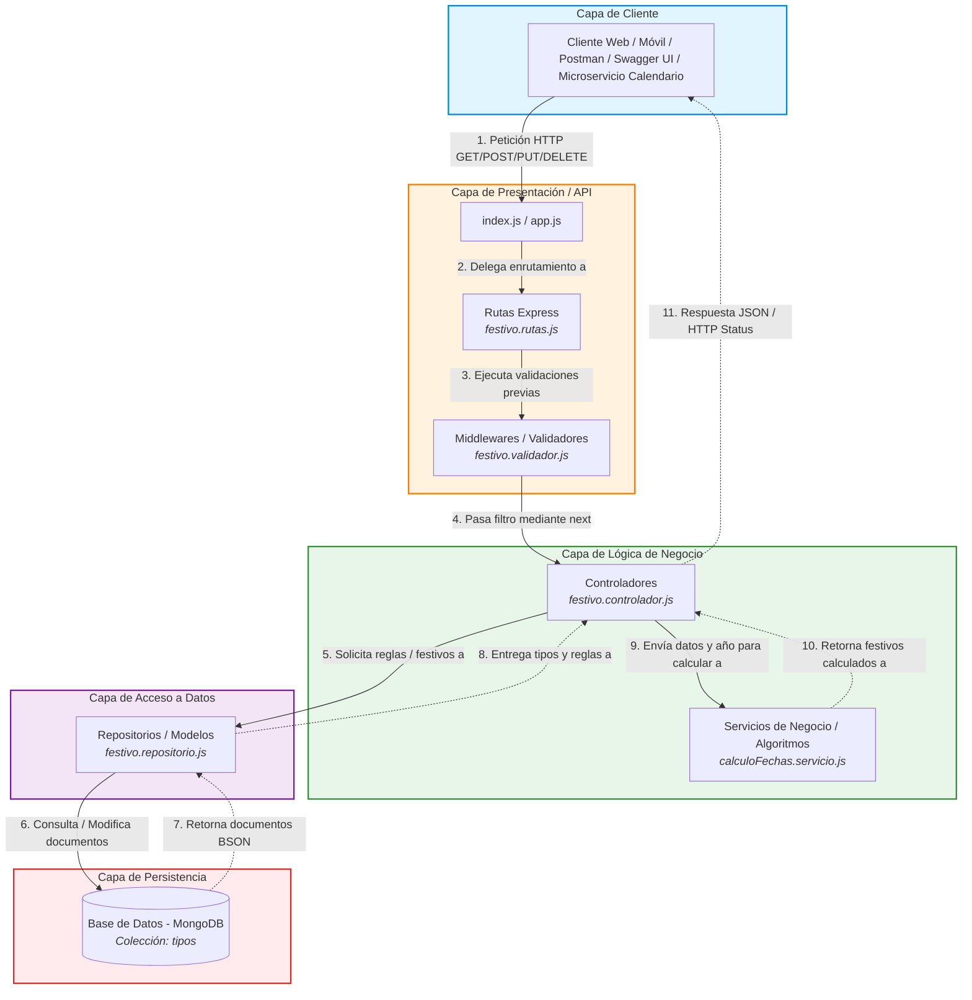

# Diagrama de Arquitectura por Capas - Microservicio API Festivos

> **Asignatura:** Arquitectura de Software II  
> **Docente:** Fray León Osorio Rivera  
> **Evaluación:** Primer Seguimiento (20%) - Diagrama 2  
> **Stack Tecnológico:** Node.js + Express.js + MongoDB  

---

## 1. Justificación Arquitectónica

Siguiendo las directrices pedagógicas y técnicas del docente Fray León Osorio Rivera, este modelo arquitectónico representa con fidelidad la implementación real del microservicio en **Node.js** y **Express.js**, evitando abstracciones vacías y reflejando los componentes de código físicos de la solución:

1. **Principio de Separación de Responsabilidades (*Separation of Concerns*):**
   Cada nivel del sistema asume un rol delimitado. Una capa superior solo interactúa con su capa inmediatamente inferior para peticiones, y recibe respuestas hacia arriba sin saltos cruzados.

2. **Capa de Entrada y Cadena de Responsabilidad (*Chain of Responsibility*):**
   Las solicitudes HTTP entrantes ingresan por `index.js / app.js` y se enrutan mediante `festivo.rutas.js`. Antes de que una petición alcance el controlador, pasa por una tubería de middlewares en `festivo.validador.js` (verificación de existencia de parámetros, formato numérico de año/mes/día y validez de calendario como descartar el 35 de febrero). Si la validación falla, se interrumpe el flujo y se responde inmediatamente; si es correcta, el método `next()` transfiere el control a la capa de negocio.

3. **Aislamiento del Servicio de Negocio (`calculoFechas.servicio.js`):**
   Conforme a la directriz explícita del docente en clase (*"en la base de datos no están las fechas festivas, sino las reglas para calcularlas"*), la lógica algorítmica matemática (Cálculo del Domingo de Pascua por el algoritmo de Butcher/Meeus, Domingo de Ramos, desplazamientos de días y traslado al siguiente lunes por la Ley 51 de 1983 - Ley Emiliani) se aísla en un servicio especializado desacoplado del controlador HTTP.

4. **Acceso a Datos Directo y Persistencia:**
   `festivo.repositorio.js` gestiona la conexión con el clúster de **MongoDB** y ejecuta operaciones CRUD y consultas directas sobre la colección `tipos` (con sus documentos embebidos de festivos).

---

## 2. Diagrama de Arquitectura por Capas en Mermaid

---

## 3. Matriz de Componentes y Responsabilidades

| Capa | Archivo / Componente | Responsabilidad Técnica |
| :--- | :--- | :--- |
| **Cliente** | Postman / Swagger / API Calendario | Genera peticiones HTTP y consume endpoints RESTful bajo formato JSON. |
| **Presentación** | `index.js` / `app.js` | Inicializa el servidor Express, configura middlewares globales (`cors`, `express.json`), define el puerto y monta las rutas base `/api/festivos` y la documentación `/api-docs`. |
| **Presentación** | `festivo.rutas.js` | Define el mapeo de verbos HTTP (`GET`, `POST`, `PUT`, `DELETE`) hacia las funciones del controlador, asociando los validadores respectivos. |
| **Presentación** | `festivo.validador.js` | Middleware que implementa el patrón **Chain of Responsibility**: valida que el año, mes y día existan, sean enteros positivos, y correspondan a fechas reales del calendario gregoriano (ej. rechaza fechas inválidas como 35/02/2023 antes de entrar al controlador). |
| **Negocio** | `festivo.controlador.js` | Orquesta la interacción: recibe parámetros de request (`req.params`, `req.body`), invoca al repositorio para consultar reglas de cálculo, delega el cálculo matemático al servicio y construye la respuesta HTTP con códigos de estado semánticos (`200 OK`, `400 Bad Request`, `404 Not Found`). |
| **Negocio** | `calculoFechas.servicio.js` | Contiene el núcleo algorítmico: cálculo del Domingo de Pascua, Domingo de Ramos, traslados de festivos al lunes según Ley 51 de 1983, comparación de fechas y generación del arreglo de festivos del año solicitado. |
| **Acceso a Datos**| `festivo.repositorio.js` | Abstrae la comunicación con el driver de MongoDB. Realiza queries atómicas sobre la colección `tipos` (`find`, `findOne`, `updateOne`, `push` en arrays de subdocumentos). |
| **Persistencia** | MongoDB (`festivos_db`) | Motor de base de datos NoSQL donde residen los documentos de los 4 tipos de festivos y sus festivos embebidos. |

---

## 4. Endpoints Expuestos por la Arquitectura

1. **Verificación de Fecha Festiva:**
   * **Ruta:** `GET /api/festivos/verificar/:anio/:mes/:dia`
   * **Ejemplo Válido Festivo:** `/api/festivos/verificar/2023/6/12` $\rightarrow$ Respuesta: `"Es Festivo"`
   * **Ejemplo No Festivo:** `/api/festivos/verificar/2023/2/28` $\rightarrow$ Respuesta: `"No es festivo"`
   * **Ejemplo Fecha Inválida:** `/api/festivos/verificar/2023/2/35` $\rightarrow$ Respuesta: `"Fecha No valida"` (Interceptado por validador).

2. **Obtener Todos los Festivos de un Año:**
   * **Ruta:** `GET /api/festivos/obtener/:anio`
   * **Propósito:** Endpoint de integración requerido por el Microservicio 2 (Calendarios Laborales en Spring Boot).
   * **Respuesta:** Array JSON con objetos `{ "festivo": "...", "fecha": "AAAA-MM-DD" }`.

3. **CRUD de Configuración de Festivos:**
   * `POST /api/festivos/agregar` $\rightarrow$ Agrega un nuevo festivo dentro de un tipo existente (ej. Virgen de Chiquinquirá).
   * `PUT /api/festivos/modificar` $\rightarrow$ Actualiza los datos de cálculo de un festivo embebido.
   * `DELETE /api/festivos/eliminar/:id` $\rightarrow$ Elimina la regla de un festivo del arreglo.
