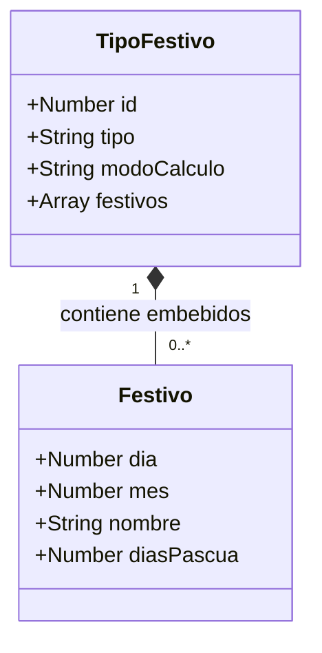

# Modelo Objetual de Base de Datos NoSQL (MongoDB) - API Festivos

> **Asignatura:** Arquitectura de Software II  
> **Docente:** Fray León Osorio Rivera  
> **Evaluación:** Primer Seguimiento (20%) - Diagrama 1  
> **Tecnología:** MongoDB / Mongoose / JSON  

---

## 1. Justificación Arquitectónica del Modelo NoSQL

En bases de datos relacionales tradicionales (RDBMS) se utiliza el diagrama Entidad-Relación (ER) para normalizar datos en múltiples tablas vinculadas por llaves foráneas (`FK`). Sin embargo, en bases de datos NoSQL orientadas a documentos como **MongoDB**, los datos se estructuran de forma desnormalizada u orientada a agregados (formato BSON/JSON).

Para modelar este paradigma, el estándar adoptado por la industria y requerido en el curso es el **Diagrama de Clases (Class Diagram)** con relaciones de **Agregación/Composición**:
1. **Colección Principal (`tipos`):** Almacena los tipos de reglas para el cálculo de festivos en Colombia.
2. **Documentos Embebidos (`festivos`):** Cada tipo de festivo contiene un arreglo (`Array`) de documentos embebidos con los festivos específicos pertenecientes a dicha categoría.
3. **Cardinalidad `1 *-- "0..*"`:** Representa que un documento raíz de `TipoFestivo` agrupa y contiene embebidos cero o múltiples objetos de tipo `Festivo`. No se requiere una colección separada ni operaciones `JOIN`, garantizando lecturas atómicas de alto rendimiento.

---

## 2. Diagrama Objetual en Mermaid



---

## 3. Diccionario de Datos y Mapeo con MongoDB

### Documento Raíz: Colección `tipos` (`TipoFestivo`)

| Campo | Tipo BSON / JS | Restricción / Formato | Descripción |
| :--- | :--- | :--- | :--- |
| `id` | `Number` (Int32) | Identificador único (`PK` lógica) | Identificador del tipo de festivo (Valores del 1 al 4). |
| `tipo` | `String` | Obligatorio | Nombre descriptivo de la categoría (ej. *"Fijo"*, *"Ley de Puente Festivo"*, *"Basado en Pascua"*). |
| `modoCalculo` | `String` | Obligatorio | Regla de negocio que define la forma matemática o traslación del día festivo. |
| `festivos` | `Array[Object]` | Embebido (`0..*`) | Lista de documentos embebidos que aplican esta regla. |

### Subdocumento Embebido: `Festivo`

| Campo | Tipo BSON / JS | Restricción / Formato | Descripción |
| :--- | :--- | :--- | :--- |
| `dia` | `Number` (Int32) | Opcional (1 - 31) | Día calendario del mes (aplica para tipos 1 y 2). |
| `mes` | `Number` (Int32) | Opcional (1 - 12) | Mes calendario del año (aplica para tipos 1 y 2). |
| `nombre` | `String` | Obligatorio | Nombre oficial de la celebración festiva (ej. *"Año Nuevo"*, *"Jueves Santo"*, *"Virgen del Carmen"*). |
| `diasPascua` | `Number` (Int32) | Opcional (Entero con signo) | Desplazamiento en días respecto al Domingo de Pascua (ej. `-3` para Jueves Santo, `+40` para Ascensión). |

---

## 4. Representación del Esquema BSON / JSON Real en MongoDB

El diagrama de clases anterior mapea de forma idéntica a la estructura de la base de datos entregada por el docente:

```json
{
  "_id": "64f1a2b3c4d5e6f7a8b9c0d1",
  "id": 2,
  "tipo": "Ley de Puente festivo",
  "modoCalculo": "Se traslada la fecha al siguiente lunes",
  "festivos": [
    {
      "dia": 6,
      "mes": 1,
      "nombre": "Santos Reyes"
    },
    {
      "dia": 19,
      "mes": 3,
      "nombre": "San José"
    },
    {
      "dia": 9,
      "mes": 7,
      "nombre": "Virgen de Chiquinquirá"
    }
  ]
}
```
