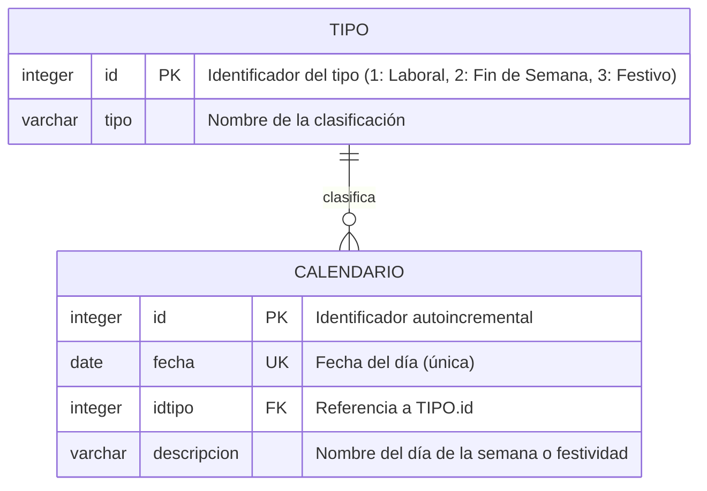

# Modelo Relacional de Base de Datos (PostgreSQL) - API Calendario

> **Asignatura:** Arquitectura de Software II  
> **Docente:** Fray León Osorio Rivera (`frayosorio@gmail.com`)  
> **Evaluación:** Segundo Seguimiento (20%) - Diagrama de Base de Datos  
> **Tecnología:** PostgreSQL / Spring Data JPA (Hibernate)  
> **Fecha Límite:** 8 de Octubre de 2026  

---

## 1. Justificación del Modelo Relacional

A diferencia del microservicio de Festivos (MongoDB), el microservicio de Calendario persiste datos estructurados, con un esquema fijo y una relación clara entre entidades, por lo que se usa una base de datos relacional (**PostgreSQL**) modelada mediante un **Diagrama Entidad-Relación (ER)**.

El modelo corresponde al enunciado y diseño establecido en clase:

1. **Tabla `tipo`:** Catálogo con las tres clasificaciones posibles de un día: *Día laboral*, *Fin de Semana* y *Día festivo*.
2. **Tabla `calendario`:** Un registro por cada día del año generado, con su fecha, su clasificación (`idtipo`) y una descripción (nombre del día de la semana o nombre de la festividad).
3. **Cardinalidad `1 : 0..*`:** Un tipo clasifica cero o muchos días del calendario; cada día pertenece exactamente a un tipo. La relación se implementa con la llave foránea `calendario.idtipo → tipo.id`.

---

## 2. Diagrama Entidad-Relación en Mermaid



---

## 3. Diccionario de Datos

### Tabla `tipo`

| Campo | Tipo PostgreSQL | Restricción | Descripción |
| :--- | :--- | :--- | :--- |
| `id` | `INTEGER` | `PK` | Identificador del tipo de día. |
| `tipo` | `VARCHAR(50)` | `NOT NULL` | Nombre de la clasificación. |

**Datos iniciales (catálogo fijo):**

| id | tipo |
| :-: | :--- |
| 1 | Día laboral |
| 2 | Fin de Semana |
| 3 | Día festivo |

### Tabla `calendario`

| Campo | Tipo PostgreSQL | Restricción | Descripción |
| :--- | :--- | :--- | :--- |
| `id` | `SERIAL` | `PK` | Identificador autoincremental del día. |
| `fecha` | `DATE` | `NOT NULL`, `UNIQUE` | Fecha del día. Se usa `DATE` (sin hora) para evitar desfases por zona horaria. |
| `idtipo` | `INTEGER` | `NOT NULL`, `FK → tipo.id` | Clasificación del día. |
| `descripcion` | `VARCHAR(100)` | | Nombre del día de la semana (ej. "Lunes", "Domingo") o nombre del festivo. |

---

## 4. Script DDL de Referencia (SQL)

```sql
CREATE TABLE tipo (
    id   INTEGER     PRIMARY KEY,
    tipo VARCHAR(50) NOT NULL
);

CREATE TABLE calendario (
    id          SERIAL       PRIMARY KEY,
    fecha       DATE         NOT NULL UNIQUE,
    idtipo      INTEGER      NOT NULL REFERENCES tipo(id),
    descripcion VARCHAR(100)
);

INSERT INTO tipo (id, tipo) VALUES
    (1, 'Día laboral'),
    (2, 'Fin de Semana'),
    (3, 'Día festivo');
```

---

## 5. Mapeo con Spring Data JPA

| Tabla | Entidad JPA (`Infraestructura`) | Relación JPA |
| :--- | :--- | :--- |
| `tipo` | `TipoEntidad` | — |
| `calendario` | `CalendarioEntidad` | `@ManyToOne` hacia `TipoEntidad` mediante `@JoinColumn(name = "idtipo")` |

La respuesta del endpoint `GET /api/calendario/listar/{anio}` refleja esta relación, devolviendo el tipo anidado dentro de cada día:

```json
{
  "id": 1,
  "fecha": "2026-01-01",
  "tipo": { "id": 3, "tipo": "Día festivo" },
  "descripcion": "Año Nuevo"
}
```
